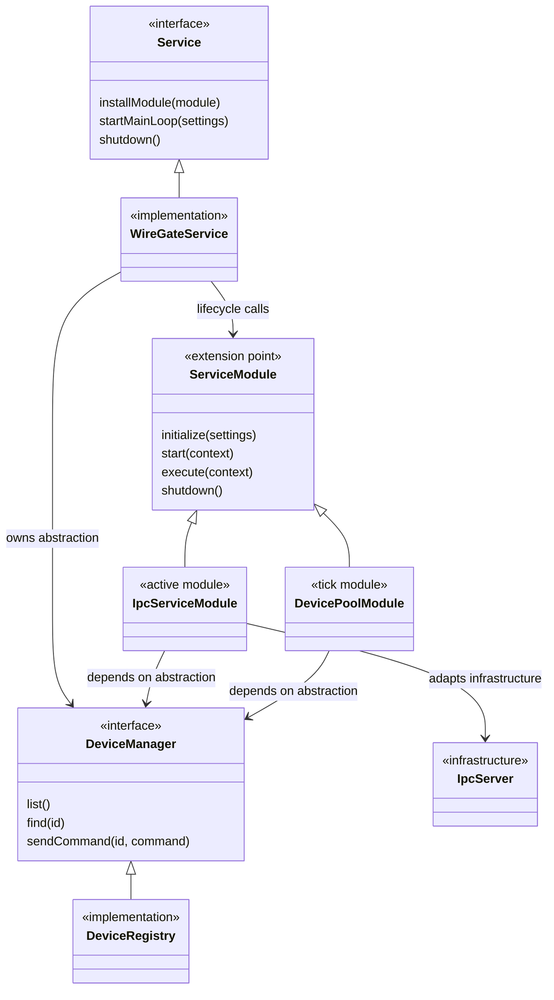

<!--
SPDX-FileCopyrightText: 2026 Daryna Vasylchenko (KernelNova) <daryna.vasylchenko@gmail.com>
SPDX-License-Identifier: GPL-3.0-or-later
-->

# WireGate Abstraction Relations

This diagram intentionally hides most implementation detail and shows the main dependency-inversion boundaries.

