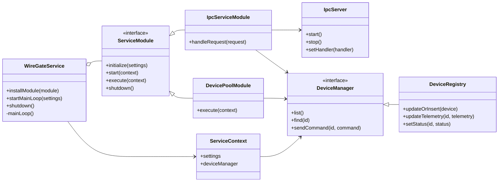

<!--
SPDX-FileCopyrightText: 2026 Daryna Vasylchenko (KernelNova) <daryna.vasylchenko@gmail.com>
SPDX-License-Identifier: GPL-3.0-or-later
-->

# WireGate Concept Class Diagram

This is the compact class diagram for explaining the general design. It avoids low-value members and focuses on the core idea: a service orchestrates modules, modules use shared context, and device state is accessed through an abstraction.

