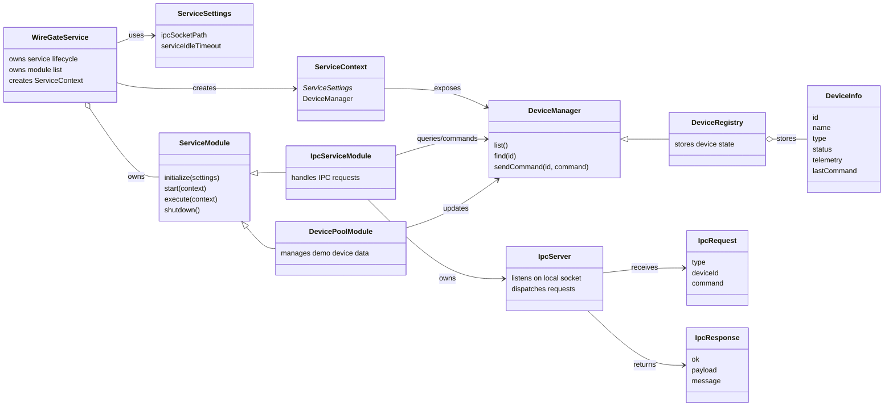

<!--
SPDX-FileCopyrightText: 2026 Daryna Vasylchenko (KernelNova) <daryna.vasylchenko@gmail.com>
SPDX-License-Identifier: GPL-3.0-or-later
-->

# WireGate Generic Entity Relations

This diagram focuses on runtime relationships between the main service, modules, IPC infrastructure, and device model.

