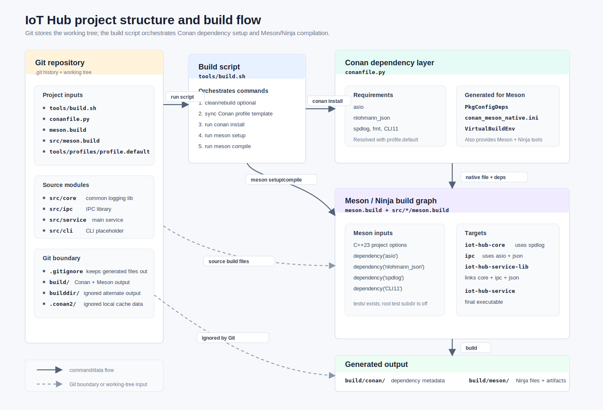

<!--
SPDX-FileCopyrightText: 2026 Daryna Vasylchenko (KernelNova) <daryna.vasylchenko@gmail.com>
SPDX-License-Identifier: GPL-3.0-or-later
-->

# Project Structure Visualization

This diagram shows the main interaction path:

1. Git stores the working tree, build recipes, source modules, and ignore rules.
2. `tools/build.sh` orchestrates profile setup, Conan install, Meson setup, and Meson compile.
3. Conan resolves third-party dependencies and generates Meson-compatible metadata under `build/conan/`.
4. Meson reads the root and module `meson.build` files, consumes Conan metadata, and builds targets under `build/meson/`.

Generated build folders such as `build/` and `builddir/` are intentionally kept outside Git by `.gitignore`.

## Class diagrams

- [Generic entity relations](./class-diagram-entities.md)
- [Abstraction relations](./class-diagram-abstractions.md)
- [Concept class diagram](./class-diagram-concept.md)
